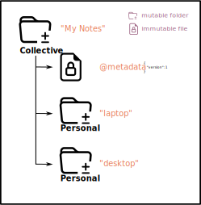
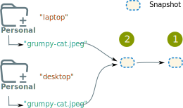
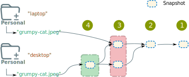
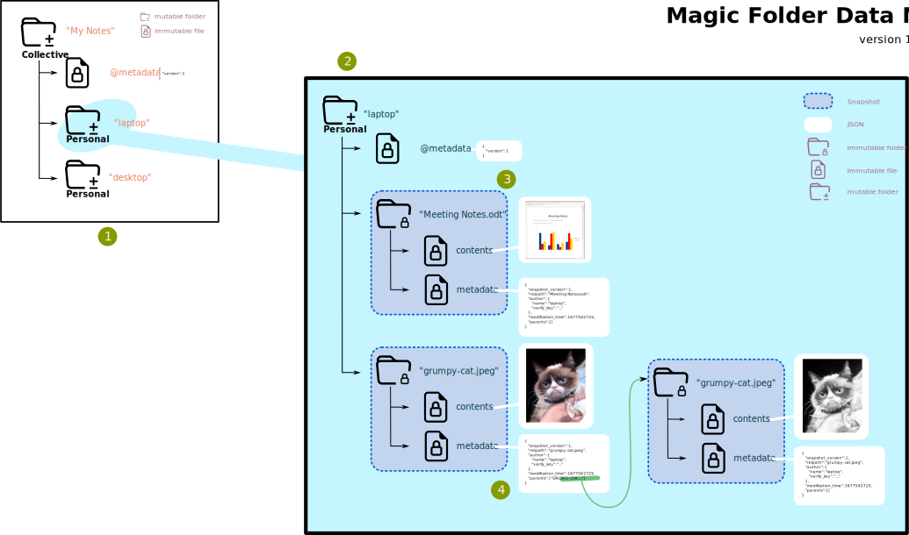

.. -*- coding: utf-8 -*-

.. _datamodel:

Magic Folder Data Model
=======================

Audience
~~~~~~~~

This document describes the datamodel of on-Grid objects that magic-folder writes to Tahoe-LAFS.
Developers working on magic-folder itself or integrating with it may be interested in these details.

See also :ref:`snapshots` for more information about the Snapshots themselves.

Familiarity with Tahoe-LAFS is assumed (see the next section for a brief refresh of what we need here).

Here we describe *Version 1* of the datamodel.
There are no other versions.

Common English words that have special meaning here are capitalized, like: Folder, Participant, etc.


Terminology
-----------

A collection of Tahoe-LAFS servers constitutes "a **Grid**".

Tahoe-LAFS stores data in "**Capabilities**".
In this document, we talk about several kinds of these:

- **Immutable Capability**: some data whose contents will never change (write once).

- **Mutable Directory Capability**: this sort of capability allows one computer to hold a "Write Capability" that authorizes changes while sharing a **Read-Only Directory Capability** with other computers.
  Clients with the latter kind will see changes made.
  The capability contains names pointing to either contents (files) or other Directory Capabilities (sub-directories).

  It is **vital to note** that **only a single computer** may hold and use the Write Capability.

- **Immutable Directory Capability**: similar to above, except there is no write Capability: the contents will never change.

You can read a lot more in `Tahoe-LAFS's Capabilities documentation <https://tahoe-lafs.readthedocs.io/en/latest/architecture.html#capabilities>`_.


High-Level View
---------------

At a very high level, ``magic-folder`` contains one or more "**Folders**".
These represent a collection of files to synchronize to one or more computers.
Each computer is called a **Participant**.

Participants may be "read-only" or "read-write"; the latter kind can introduce new files or changes to existing files.

A Folder is represented in Tahoe-LAFS as a Mutable Directory.
We call this "**the Collective**".
This directory lists all the Participants: it maps their name to a Capability.
For read-only Participants, this will be an empty Immutable.
For read-write Participants their name will map the a Read-Only Directory Capability.

The single computer that holds the Write Capability to this Mutable Directory is known as "the admin".
They decide who the participants are, what they are named and whether they are read-only or read-write.

All read-write Participants hold the single Write Capability corresponding to their public Read-Only Directory Capability.
We call these the "**Personal**" directory.

Here is an example: we have a Folder called "My Notes" whose Collective contains two Participants named "laptop" and "desktop".
The "metadata" Immutable contains JSON describing the version (there is only one version right now, ``1``).



Recall that only a *single computer* may have the write-capabilities corresponding to the three Mutable Directories in the above diagrams.
Of course, a single computer may hold more than one write-capability: the admin will have both the Collective and their own Personal write capability.


Synchronization Model: Representing Changes
-------------------------------------------

See also the historical document :ref:`leif-design` for background.

The :ref:`snapshots` document also contains details of the current implementation.

Here, we give a broad overview of the synchronization process in order to better understand the on-Grid datamodel.

(We discuss how Snapshot objects themselves are represented lower down).


Local Changes
`````````````

The ``magic-folder`` daemons running on Participants' computers detect local changes (currently by examining the filesystem periodically and comparing timestamps).

When a local change is found, a new Snapshot is created.
This Snapshot will have zero "parent" Snapshots if it is a brand new file (i.e. not yet known to magic-folder).
Otherwise, the Snapshot will have one "parent" Snapshot, representing the latest version known to this Participant.

.. NOTE::

    There is a notion of a "local snapshot" which we won't go into here; once uploaded to the Grid, a Snapshot has a concrete representation which is what is important from a datamodel perspective.
    Obviously, some amount of time passes between an actual change to a file on disk and it being represented in the Tahoe-LAFS Grid -- from seconds to days or more (e.g. if offline).

A Snapshot will have more than one parent in case it is resolving a Conflict (see below).
In this way, we consider Snapshots as a Directed Acyclic Graph (DAG).

One can visualize this as a tree: each file has a root in the Personal directory pointing at some Snapshot that itself may point at zero or more parent Snapshots (and so on, until the very first version is reached).

When fully synchronized, all Personal directories of all Participants will point to the very same Snapshot object in the Grid (the Capability string will be identical).


Remote Changes
``````````````

Periodically, the ``magic-folder`` daemons of Participants will check the Grid for updates.

This is done by examining the Collective to determine all Participants -- that is, we list the Collective directory contents.
If any new Participants have been added since our last check, they will be considered as well.

Next, we examine each Participant's Personal folder (except our own) and determine if that file is pointing at the same Snapshot as us -- that is, we list the Personal directory contents.

If any Snapshot is different, it is downloaded and acted upon.
For a full discussion of this process, see :ref:`downloader`.

Ultimately, for normal updates or deletes, the change will be reflected (or "acknowledged" if you prefer) by updating our own Personal folder.
In case of a "conflict" (e.g. two changes at "the same" time) we will not update the Personal folder until the user resolves the conflict (this isn't possible yet, see `Issue 102 <https://github.com/LeastAuthority/magic-folder/issues/102>`_).

Considered together, an abstract view of a two-Participant example:



    An abstract view of two participants with a single file.
    The file has been changed once.

In the above, we have two Participants (``laptop`` and ``desktop``), omitting the Collective from the view.
There is a single file (``grumpy-cat.jpeg``) which has been changed once (the original version is at the green dot "1" and the newest version is at green dot "2").
We can see that both Participants are up-to-date because both Personal folders point at the latest Snapshot.


Conflicts
---------

Once a file is conflicted, it is up to the user to resolve this.
While we currently lack UI or HTTP API affordances to accomplish this, there *is* a way to model it already.

That way is by having multiple parents.
So, looking at our two-Participant case, here is an example of a conflict and its resolution.



    An abstract view of two participants with a single file.
    The file has been changed a few times, once with a conflict.

The green dots at "1" and "2" are the same as the previous diagram.
At green dot "3", both Participants made their own change, representing it as a Snapshot with a parent pointing at "2".
This is a Conflict.

Since neither Participant had seen the other's change, they both used "2" as a parent.
(If instead there had been some time to synchronize between the changes, one or the other would be first and no problem would occur).

At green point "4", the "desktop" participant has "resolved" the Conflict: they have chosen some way to do this (possibly taking one or the other version whole, or merging the changes somehow).
No matter how this was accomplished (and again, we have no UI for this yet) the conflict resolution is represented on the Grid by producing a new Snapshot (at green dot "4") with **both** Snapshots as parents -- this communicates that the "desktop" Participant saw both and did something to decide that the new snapshot at "4" is the correct way to move forward. In cases with more Participants, there could be more conflicting Snapshots and thus more than two parents.

We can also see in this diagram that participant "laptop" has **not yet updated** fully, as they are still pointing at "3".


Snapshot Representation
-----------------------

So far we've looked abstractly at Snapshots.
While the :ref:`snapshots` document describes the process, lets me more concrete.

Here is a fully-worked diagram of a complete Folder called "My Notes" with two Participants ("laptop", "desktop") that have two files ("Meeting Notes.odt" and "grumpy-cat.jpeg"). The main change here is visualizing all the parts.



    A fully featured view of the magic-folder datamodel.

Let's examine the pieces.

At "1", we have the Collective.
This contains the ``metadata`` (confirming this version, ``1``) and two participants: ``"laptop"`` and ``"desktop"``.
Each of these are Mutable folders.
We don't know from this view whether "laptop" or "desktop" holds the Write Capability to the Collective (and is thus "the admin).
The only way to know this is to ask.

At "2" we see one of the Participant's Personal directories expanded (in this case, ``"laptop"``).
It also has a ``metadata`` confirming the version.

The blue bubbles expand the Snapshots to their actual on-Grid representation.
They are Immutable Directories containing two entries: ``"contents"`` and ``"metadata"``.

The ``"contents"`` entry points at an Immutable Capability containing the actual contents of this version.
The ``"metadata"`` entry points at an Immutable Capability containing JSON that will deserialize to a representation of some information about this entry.

We see it has a ``"snapshot_version"``, the relative pathname in ``"relpath"``, the ``"modification-time"`` (in seconds-since-the epoch), some author information and a list of parents.

The "parents" list contains Capability strings for other Snapshot objects. In the case of ``"grumpy-cat.jpeg"`` we can see that someone has added a colour version and that the black and white version has no parents (so is the only version).


Authors
-------

The author information is usable, but there is not yet a way to collect and examine who are legitimate authors of Snapshots (that is, "Public Key Infrastructure" or PKI).
The :ref:`snapshots` document describes how the signatures are produced and how to verify them -- but as you can see the public keys are simply in the metadata.

Clients could already use this to see if authorship *change*.
A future version of the software will add some way to manage, verify, revoke and move author keys.

One such use-case could be a single human who uses multiple devices: they may wish to show they authored changes from multiple Participant devices (which would still have different Personal capabilities).
